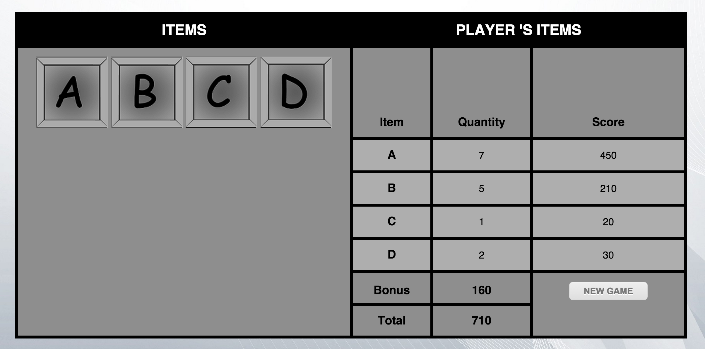
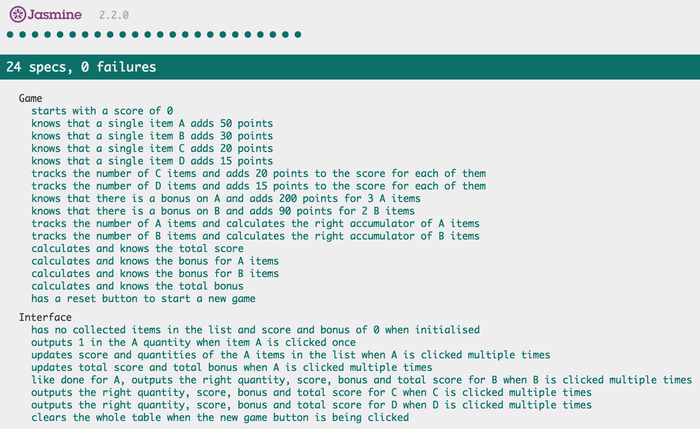

[](https://travis-ci.org/GBouffard/game_points) 

:abcd: Game Points :abcd:
===
simple browser based game points system that calculates the total points awarded to a player for a number of items they have collected in a game.

We’ll use individual letters of the alphabet to identify the items (A, B, C, and so on). Our items are scored individually. Some items are worth more if collected in multiples: collect n of them, and you’ll get y points. For example, item ‘A’ might be worth 50 points individually, but this week we have a special bonus: collect three ‘A’s and they’ll be worth 200 points instead of 150. In fact this weeks rewards are:

| Item | Unit Points | Bonus |
| ------------ | ----------- | ----------- |
| A | 50 | 200 for 3 |
| B | 30 | 90 for 2 |
| C | 20 |   |
| D | 15 |   |

Our points system accepts items in any order, so that if we collect a B, an A, and another B, we’ll recognise the two B’s and score them at 90 (for a total score so far of 140).

Technologies used
----
- Javascript
- JQuery
- Jasmine
- HTML & CSS

How to run it
----
```
git clone git@github.com:GBouffard/game_points.git
cd game_points
npm install
npm start
```
By opening your browser on http://localhost:3000, you can now you can play with the game.
Here is a screenshot of what the app looks like:



How to run tests
----
```
cd game_points
open SpecRunner.html
```

and this is what you should see:



What I learnt and what to improve
----
It took me roughly 7-8 hours to complete the exercise (if we exempt the diverse interruptions that happen when one works at home. There were many). It was especially a good reminder for me on how to use jQuery. I would be keen to refactor everything and make everything shorter and quicker but I would probably need more time. I could also have fiddled a bit more with HTML & CSS. (especially with the positionning of the elements and more colours and nicer images). Still I did want to focus first on meeting the main project's specifications before anything else; it all works and is fully tested.